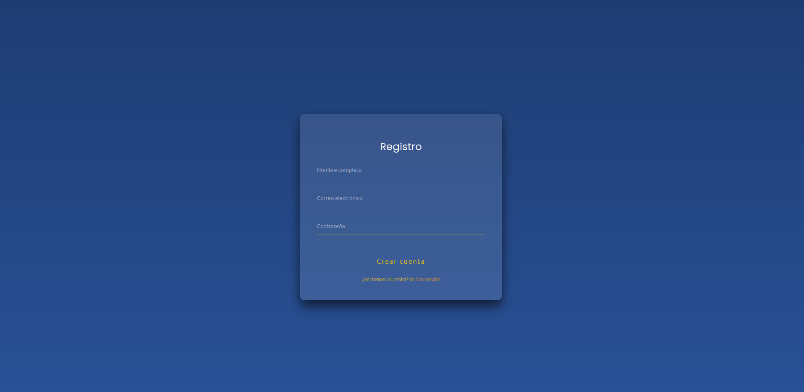
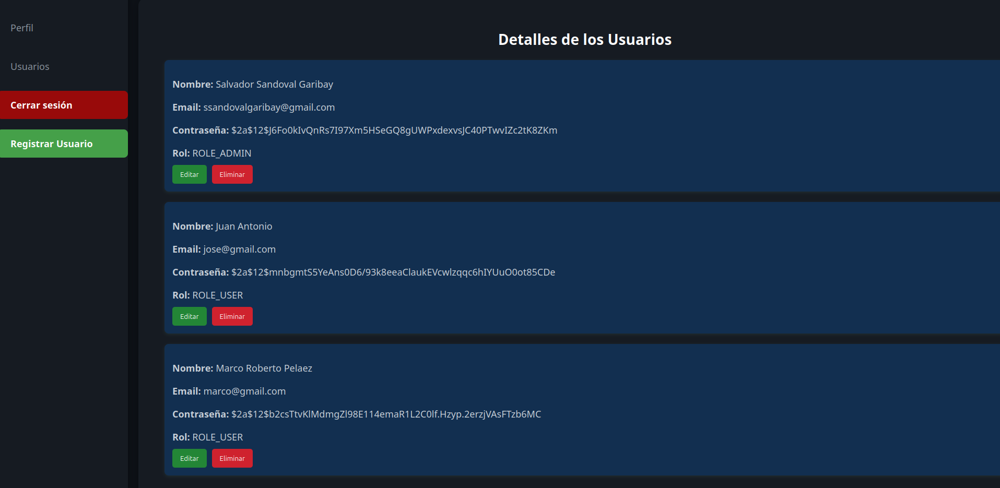
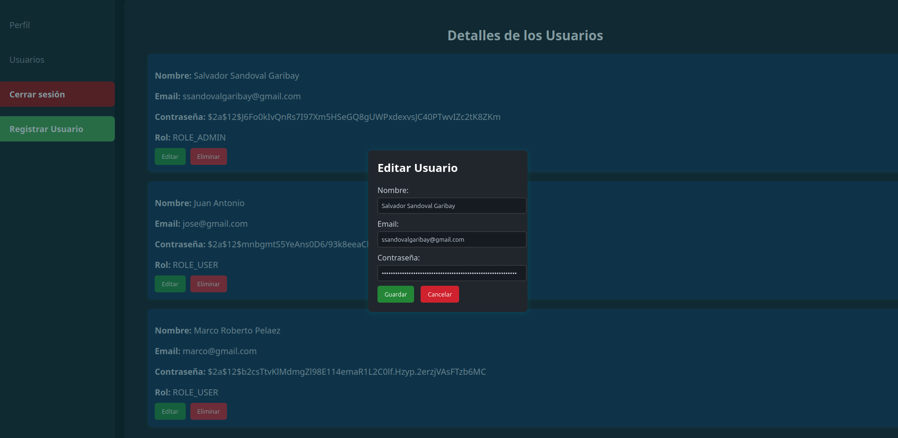
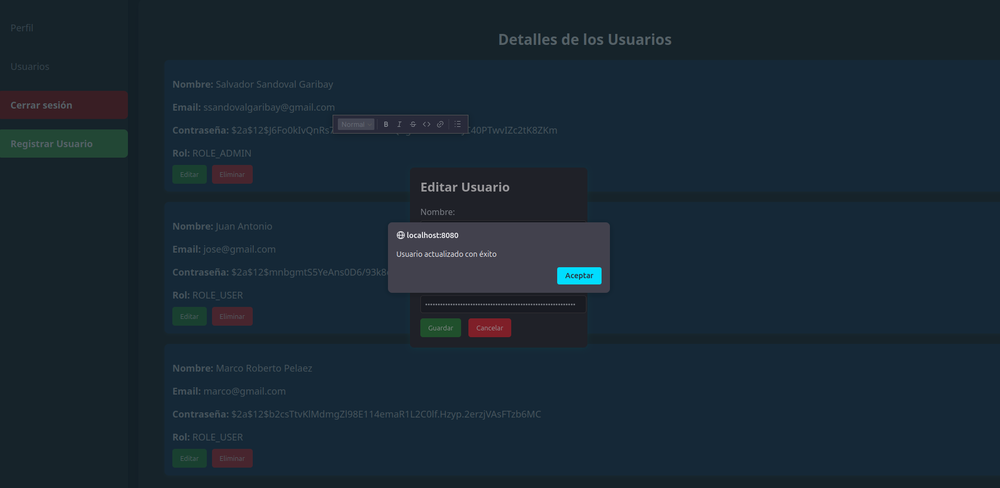
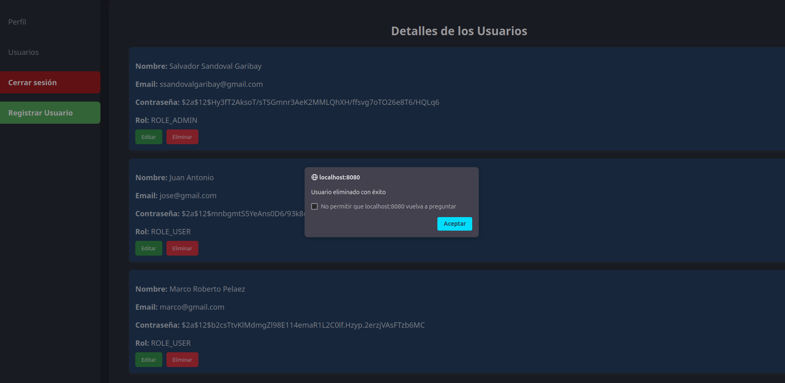
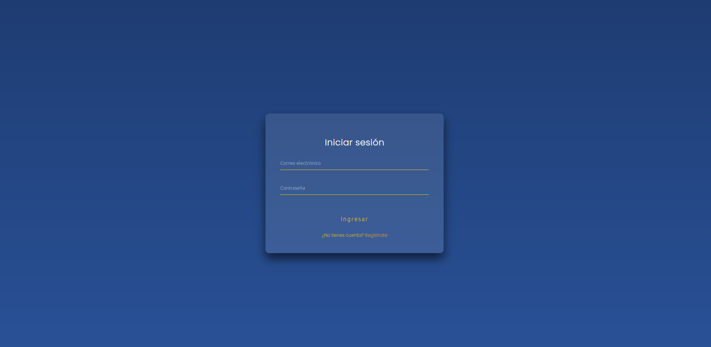
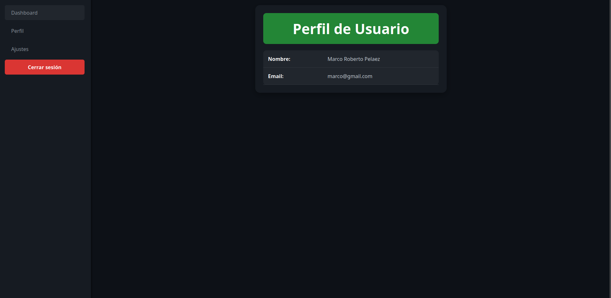

# Equipo: Error Capa 8 

## Integrantes

1. Sandoval garibay Salvador 2022630151

2. Redondo González Omar 2022630670

3. Hernández Gutiérrez Gerardo 2021630013

4. Ayala Chacón David 2022630495


## Índice
1. [Levantar Dockerfile y Docker-compose](#levantar-dockerfile-y-docker-compose)
2. [Usuario](#usuario)
3. [URL](#url)
4. [Ejecución](#ejecución)
5. [Vista Administrador](#vista-administrador)
6. [Vista Usuario](#vista-usuario)
7. [Vista Docker](#vista-docker)
8. [Pruebas de Conexión](#pruebas-de-conexión)
9. [Pruebas Automáticas](#pruebas-automáticas)
10. [Renderización en Quarkus](#renderización-en-quarkus)


# Levantar Dockerfile y Docker-compose
Para poder levantar los contenedores primero debes de posicionarte en el nivel en donde se encuentran los archivos, una manera de guiarse es si ves las carpetas ```src y target``` estas en la posición correcta.

Primero levantas el dockerfile utilizando ```docker build -t tarea3 .```seguido despues el docker compose solo es  ```docker compose up``` EN CASO DE TENER LOS PUERTOS 8080 Y 3306 OCUPADOS FAVOR DE LIBERARLOS 
# Usuario
Por predeterminado viene un usuario como admin el cual su correo es ```ssandovalgaribay@gmail.com``` y su contraseña: ```Salvador@123```
# URL
la url para este caso es http://localhost:8080/inicio/login#
# Ejecución 
De primera entrada cuando entremos a la url lo primero que veremos sera un login en donde tenemos dos opciones iniciar sesión o registrar una persona, en cierta forma en el registro se debe de poner la contraseña con mayusculas, minusculas y un caracter especial.




 # Vista Administrador

Al ser administrador la principal vista sera nuestro perfil con los datos de nombre y correo teniendo un menu del lado izquierdo el cual podemos cerrar sesion, registrar un usuario y visualizar los perfiles registrados.











# Vista Usuario
En caso de ser usuario, la vista cambiara a solo ver los datos de perfil, en este caso el menu no tiene alguna interacción a excepción de cerrar sesión pero  lo de mas esta a sujeto a futuras opciones.





# Vista Docker
Cuando ejecutamos el Dockerfile como tal nos va a descargar el jdk 17 y mapear el jar a las carpetas deployment del mismo docker 


Para el segundo que es el docker compose nos va a estar ejecutando el mysql que a su ves le pusimos que buscara en la carpeta src/db/db.sql y mapeara ese archivo en la carpeta de /var/lib/mysql para que ejecute ese archivo y como tal habilitando los puertos 8080 y 3306 para el uso de nuestra aplicación.


Algunas interacciones como tal en el sistema gracias al ORM de java nos puede dar una pequeña visualización en cada endpoint que nosotros interactuemos.


# Pruebas de conexión 
La base de datos como esta en uno de los contenedores podemos visualizar en primera instancia poniendo el comando ```docker ps``` asi listandonos los contenedores que tenemos ejecutados, para ingresar a ellos basta poniendo ```docker exec -it id-contenedor mysql -u root -p``` este ultimo argumento en este caso es para entrar directo a mysql porque podriamos ingresar usando lo mismo pero al final poniendo bash para el uso del kernel y acceso de las carpetas.


# Pruebas automáticas
Como tal para esta ocasión evitarnos el uso de postman o aplicar curl's se uso swagger-ui el cual mediante los ``@restcontrollers`` nos puede dar una visualizacion a cada uno.


En este apartado en especifico como se utilizo JWT y roles se deben autorizar por lo que cuando iniciamos sesión se adjunta el token con la informacion del usuario o administrador, en este caso en el swagger al ingresar un nuevo usuario o iniciar sesion solo es copiar el token y ponerlo ahi, OJO algunas funciones estan activas dependiendo las operaciones que pueden ejecutar, en caso de que no solo manda un error 403 el cual no estamos autorizados.


En otras si se puede como la visualización de los perfiles de cada quien


Al ser administrador se nos habilitan los demas metodos que podemos interactuar con ellos


# Renderización en Quarkus

Como tal quarkus al no tener una compatibilidad con thymeleaf tiene su propia dependencia el cual puede renderizar los html's el cual se deben de usar como si fueran controladores pero retornando el html creado.


